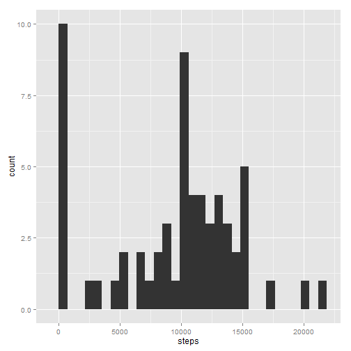

# Reproducible Research: Peer Assessment 1

Connor Gilroy, 8/16/2015

## Loading and preprocessing the data


```r
activity <- read.csv("activity/activity.csv")
options(scipen = 1, digits = 2)  # two decimals, no scientific notation
```

## What is mean total number of steps taken per day?


```r
library(dplyr)
library(ggplot2)

mean.act <- 
  activity %>%
  group_by(date) %>%
  summarise(steps = sum(steps, na.rm=TRUE))

ggplot(mean.act, aes(x=steps)) + geom_histogram()
```

 

```r
mean <- mean(mean.act$steps)
median <- median(mean.act$steps)
```

The mean number of steps per day is **9354.23** and the median number of steps per day is **10395**.

## What is the average daily activity pattern?


```r
avg.daily <- 
  activity %>%
  group_by(interval) %>%
  summarise(steps = mean(steps, na.rm=TRUE))

ggplot(avg.daily, aes(x=interval, y=steps)) + geom_line()
```

 

```r
maxsteps <- filter(avg.daily, steps == max(steps))
```

On an average day, the 5-minute interval mark at **835 minutes** contains the maximum number of steps. 

## Imputing missing values

Strategy: fill in NA values with mean for corresponding 5-minute interval.


```r
totalNAs <- length(activity$steps[is.na(activity$steps)])

## pull out NA values and replace them with values from avg.daily
activity.na <- filter(activity, is.na(steps))
activity.na <- left_join(activity.na, avg.daily, by="interval")
activity.na$steps.x = activity.na$steps.y 

## get rid of redundant column
activity.na <- select(activity.na, steps.x, date, interval) 
colnames(activity.na) <- c("steps", "date", "interval")

## add former NA values back to new data frame
activity2 <- bind_rows(filter(activity, !is.na(steps)), activity.na)
activity2 <- arrange(activity2, date, interval)

## make histogram of totals
totals.act2 <-
  activity2 %>%
  group_by(date) %>%
  summarise(steps = sum(steps))

ggplot(totals.act2, aes(x=steps)) + geom_histogram()
```

 

```r
mean2 <- mean(totals.act2$steps)
median2 <- median(totals.act2$steps)
```

The major differences in the histogram are that the middle peak is higher and there are fewer values in the bin near 0.  

With imputed missing values, the mean number of steps per day is **10766.19** and the median number of steps per day is **10766.19**.

## Are there differences in activity patterns between weekdays and weekends?


```r
## add column for days of week
act.week <-
  activity2 %>%
  mutate(weekday = weekdays(as.POSIXlt(date)))

## replace specific days with "weekday" or "weekend"
weekday = c("Monday", "Tuesday", "Wednesday", "Thursday", "Friday")
weekend = c("Saturday", "Sunday")
act.week$weekday[act.week$weekday %in% weekday] <- "weekday"
act.week$weekday[act.week$weekday %in% weekend] <- "weekend"
act.week$weekday <- factor(act.week$weekday)

act.week.mean <-
  act.week %>%
  group_by(interval, weekday) %>%
  summarise(steps = mean(steps))

ggplot(act.week.mean, aes(x=interval, y=steps)) + facet_wrap(~weekday, ncol=1) + geom_line()
```

 

Weekdays appear to have a much sharper peak in the morning (and, to a lesser extent, the evening), likely corresponding with a typical commute. Weekend steps are more evenly spread out throughout the day.
